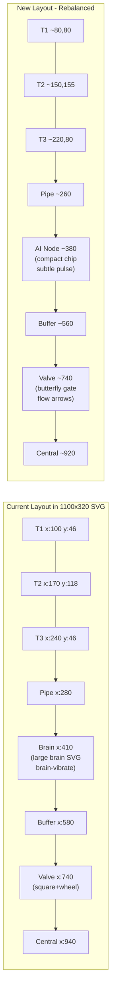
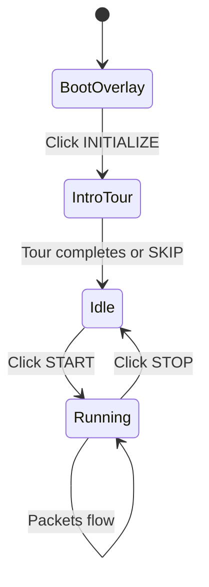

# EdgeGuard AI Command Center UI Overhaul

## 1. Replace Brain Logo on Boot Screen with Lucide-React Icon

The boot overlay in `[demo.tsx](services/react-web-app/app/routes/demo.tsx)` (lines 61-68) uses a hand-drawn SVG brain. Replace it with a combination of lucide-react icons that better represent AI/edge computing -- something like `Shield`, `Cpu`, `Activity`, or `Zap` from `lucide-react` (already installed at v0.544.0). A `ShieldCheck` or `Cpu` icon inside the glow ring would look more professional and tech-oriented.

**Files**: `[demo.tsx](services/react-web-app/app/routes/demo.tsx)` lines 61-68

## 2. Add START Button to Header Bar (Non-Functioning State Until Started)

Currently, clicking "INITIALIZE SYSTEM" on the boot overlay both dismisses the overlay AND starts the simulation (`startSimulation`). The change:

- **Boot overlay**: Keep as-is for the initial "boot" experience, but when it calls `startSimulation`, change this so it only sets a new `isInitialized` flag (dismisses overlay) but does NOT start the pipeline emission.
- **Header bar**: Add a prominent "START SYSTEM" / "STOP SYSTEM" toggle button. Until START is pressed, all turbines, pipeline, and components render in their dormant/standby state (they already support this via `isRunning` checks).
- **Store change**: Add `isInitialized` boolean to the Zustand store in `[pipelineStore.ts](services/react-web-app/app/stores/pipelineStore.ts)`. The boot overlay sets `isInitialized: true`. The header START button calls `startSimulation()`.

**Files**: `[pipelineStore.ts](services/react-web-app/app/stores/pipelineStore.ts)`, `[demo.tsx](services/react-web-app/app/routes/demo.tsx)`, `[HeaderBar.tsx](services/react-web-app/app/components/dashboard/HeaderBar.tsx)`

## 3. Make Brain/HAI Animation More Subtle + Remove Duplicate Brain

**Problem identified**: There are TWO brain SVGs in the UI:

1. **Boot overlay** (`demo.tsx` lines 61-68): A brain SVG inside the glow ring on the "INITIALIZE SYSTEM" screen. This one will be replaced by a lucide-react icon (see step 1).
2. **Pipeline view** (`PipelineView.tsx` BrainNode, lines 158-254): A large brain with hemispheres (-32 to +32), gyri folds, and aggressive animations. This one sits at `BRAIN_X=410` which is right after the turbines in the pipeline. The user sees this as "flashing brain on the left side of turbines."

The `BrainNode` has these overly aggressive animations:

- `brain-vibrate` CSS: 0.15s infinite shaking at 10 keyframe steps -- extremely fast vibration
- Outer glow ellipse pulsing at 0.6s when active
- Neural spark lines flashing at 0.4s with full opacity pulses
- Neural dots blinking at 1.2s

**Changes**:

- **Replace** the entire brain SVG paths with a compact, abstract AI node -- a clean hexagonal chip/shield shape using simple SVG geometry (~50% smaller than current brain).
- **Kill** the `brain-vibrate` CSS animation entirely. Replace with a very subtle, slow glow pulse (3-4s cycle, opacity 0.1-0.25 range).
- **Remove** the neural spark lines, gyri fold paths, and hemisphere paths.
- **Keep** only a simple core glow dot and the "EDGE AI" / "ISOLATION FOREST" labels.
- **In `app.css`**: Replace the `brain-vibrate` keyframes with a gentle `ai-pulse` animation (slow opacity breath, no position shaking).

**Files**: `[PipelineView.tsx](services/react-web-app/app/components/pipeline/PipelineView.tsx)` (BrainNode component), `[app.css](services/react-web-app/app/app.css)` (brain-vibrate animation)

## 4. Fix Pipeline Geometry and Element Centering

**Problem identified**: The SVG viewBox is `0 0 1100 320`. Current element positions:


| Element | X        | Y               | Issue                |
| ------- | -------- | --------------- | -------------------- |
| T1      | 100      | 46 (hub at 12)  | Far left, top corner |
| T2      | 170      | 118 (hub at 84) | Far left             |
| T3      | 240      | 46 (hub at 12)  | Far left             |
| Pipe    | 280-1060 | 160             | Center-line          |
| Brain   | 410      | 160             | --                   |
| Buffer  | 580      | 160             | --                   |
| Valve   | 740      | 160             | --                   |
| Central | 940      | 160             | Far right            |


Issues:

- Turbines are crammed into the leftmost 22% (x: 100-240 of 1100) and sit very high (y: 12-118 of 320), far above the pipe at y=160.
- Huge dead space between turbines and pipe start.
- Elements are not evenly distributed -- 780px of pipe for 4 nodes, but spacing is 130/170/160/200.

**Proposed new geometry** (rebalance in `pipelineGeometry.ts`):

- Shift turbines right and down so they're better centered vertically around the pipe midline
- Proposed turbine positions: T1 at ~(80, 80), T2 at (150, 155), T3 at (220, 80) -- this places T2 on the pipe line and T1/T3 above it, forming a tighter triangle
- Space pipeline nodes more evenly: Brain at ~380, Buffer at ~560, Valve at ~740, Central at ~920
- Ensure pipe start (260) aligns with the right edge of the turbine cluster
- Adjust viewBox height if needed (e.g. 340 or 360) to accommodate better vertical centering
- Verify all labels, data beams, and packet entry paths work with new positions

**Files**: `[pipelineGeometry.ts](services/react-web-app/app/components/pipeline/pipelineGeometry.ts)`, `[PipelineView.tsx](services/react-web-app/app/components/pipeline/PipelineView.tsx)` (TurbineGlyph, packetEntryPosition, VIEW dimensions)

## 5. Redesign Valve Node

The current `ValveNode` in `[PipelineView.tsx](services/react-web-app/app/components/pipeline/PipelineView.tsx)` (lines 382-445) is a generic 56x56 rounded square with a spoke-wheel inside -- it doesn't read as an industrial valve. It also uses a crude line across the center for the "closed" state.

**Redesign as a butterfly/gate valve**:

- Replace the square+wheel with a proper pipe-section valve shape: two pipe stubs on left and right (connecting to the pipeline), with a disc/gate element in the center
- **Open state**: The gate disc is rotated parallel to flow (thin line), allowing a visible flow-through gap. Subtle flow arrows or dashes animate through. Cyan glow.
- **Closed state**: The gate disc rotates perpendicular to flow (full blocking disc), with a clear "blocked" visual. Red warning ring. No flow-through.
- Add animated rotation transition between open/closed (using SVG `transform` or Framer Motion) for a satisfying click interaction
- Pipe stubs on either side integrate visually with the pipeline paths
- Keep the label "VALVE OPEN" / "VALVE SHUT" / "STANDBY" below
- Make it slightly larger (70x50 instead of 56x56) to better fit the pipe aesthetic

**Files**: `[PipelineView.tsx](services/react-web-app/app/components/pipeline/PipelineView.tsx)` (ValveNode component)

## 6. Improve Overall Page Layout

The current layout in `[demo.tsx](services/react-web-app/app/routes/demo.tsx)` (line 164) uses `grid-cols-[200px_1fr_200px]` which creates cramped 200px side columns. The turbine cards and storage panel feel squeezed.

**Layout changes**:

- **Widen side columns**: Change to `grid-cols-[220px_1fr_240px]` -- the storage panel needs slightly more room for the summary metrics
- **Make the main area scrollable**: Instead of `h-screen` with `min-h-0` overflow hidden, use a scrollable main area so the data tables fit below the pipeline without requiring a separate scroll zone
- **Vertical distribution**: The pipeline SVG currently sits in a flex `items-center justify-center` container that can waste vertical space. Pin it to top with a fixed max-height so the data tables below get room
- **Remove `pb-14`** on the grid (that's padding for the audit ticker) -- instead use proper spacing
- **Responsive gap**: Increase gap from `gap-3` to `gap-4` for more breathing room

New layout structure:

```
[HeaderBar with START/STOP]
[Scrollable content area]
  [220px TurbineCards+Connection | 1fr PipelineView | 240px StoragePanel(summary)]
  [Edge Table (50%) | Central Table (50%)]  <-- full width below pipeline
[AuditTicker (fixed bottom)]
```

**Files**: `[demo.tsx](services/react-web-app/app/routes/demo.tsx)`

## 7. Increase Data Flow Speed

In `[pipelineStore.ts](services/react-web-app/app/stores/pipelineStore.ts)`:

- `PROGRESS_SPEED_TO_BUFFER = 0.8` -> increase to ~`1.1`
- `PROGRESS_SPEED_TO_CENTRAL = 0.7` -> increase to ~`1.0`

In `[usePipelineEmission.ts](services/react-web-app/app/hooks/usePipelineEmission.ts)`:

- `EMIT_INTERVAL_MS = 550` -> decrease to ~`400`
- `DRAIN_INTERVAL_MS = 450` -> decrease to ~`350`

These combined will make packets move ~30-40% faster through the pipeline.

**Files**: `[pipelineStore.ts](services/react-web-app/app/stores/pipelineStore.ts)` lines 12-13, `[usePipelineEmission.ts](services/react-web-app/app/hooks/usePipelineEmission.ts)` lines 4-5

## 8. Add Data Tables at Bottom for Edge & Central Couchbase

Currently, the edge/central storage data is shown in the right-side `StoragePanel` with tiny scrolling lists (8px font) that are hard to read. Add a new section **below the pipeline SVG** with two side-by-side tables:

- **Edge Couchbase Table**: 2-column layout showing recent data points with seq, value, anomaly score, type, and compacted block summaries.
- **Central Couchbase Table**: Same format showing synced items.
- Use a proper table layout with headers (`font-display` Orbitron at 10-11px, mono data at 11px) in the EdgeGuard theme.
- Show the last ~10 items from each store, auto-scrolling.
- Keep the existing `StoragePanel` on the right for summary metrics (capacity bar, compaction count, etc.) but move the `StorageList` data into these new bottom tables.

Create a new component `DataTables.tsx` in `components/dashboard/`.

**Files**: New file `[DataTables.tsx](services/react-web-app/app/components/dashboard/DataTables.tsx)`, modify `[demo.tsx](services/react-web-app/app/routes/demo.tsx)` layout, optionally simplify `[StoragePanel.tsx](services/react-web-app/app/components/dashboard/StoragePanel.tsx)`

## 9. Remove Instruction Text Bar

The instructions bar at the bottom of PipelineView ("CLICK TURBINE -> inject anomaly | CLICK VALVE -> toggle connection | WATCH BUFFER -> see compaction") in `[PipelineView.tsx](services/react-web-app/app/components/pipeline/PipelineView.tsx)` lines 703-716 -- remove this entire `<div>` block.

**Files**: `[PipelineView.tsx](services/react-web-app/app/components/pipeline/PipelineView.tsx)` lines 703-716

## 10. Add Guided Introduction / Tour

After the boot overlay dismisses (and before the user clicks START), add an animated introduction sequence that highlights each component:

1. **Step 1**: Camera/spotlight focuses on Turbines T1, T2, T3 with a label "Wind Turbines -- Data Sources generating telemetry"
2. **Step 2**: Moves to the Edge AI node with "HAI Intelligence Layer -- Isolation Forest anomaly detection"
3. **Step 3**: Highlights the Edge Couchbase buffer with "Edge Couchbase -- Local storage with tiered compaction"
4. **Step 4**: Shows the Valve and Central DB with "Sync Valve and Central Couchbase -- Cloud synchronization"
5. **Step 5**: Fades out, reveals full UI with START button ready

Implementation approach:

- New component `IntroTour.tsx` in `components/dashboard/`
- Uses Framer Motion `AnimatePresence` with sequential steps (auto-advancing every ~3s or on click)
- Each step uses a spotlight/highlight overlay that dims everything except the target component
- Add an `introComplete` flag to the store; once tour finishes, it sets this and the START button becomes prominent
- The tour runs automatically after boot overlay dismisses, or the user can skip it

**Files**: New file `[IntroTour.tsx](services/react-web-app/app/components/dashboard/IntroTour.tsx)`, modify `[demo.tsx](services/react-web-app/app/routes/demo.tsx)`, modify `[pipelineStore.ts](services/react-web-app/app/stores/pipelineStore.ts)`

---

## Execution Order

Tasks should be implemented in this dependency order:

1. **Store changes** (step 2) -- needed by everything else
2. **Geometry rebalance** (step 4) + **Remove instructions** (step 9) -- foundational SVG layout
3. **Boot icon** (step 1) + **Brain redesign** (step 3) + **Valve redesign** (step 5) -- SVG node replacements
4. **Speed increase** (step 7) -- simple constant changes
5. **Header START button** (step 3) -- depends on store changes
6. **Layout improvement** (step 6) + **Data tables** (step 8) -- page layout restructuring
7. **Intro tour** (step 10) -- last, depends on everything being positioned

## Layout Changes Summary

The demo page layout in `[demo.tsx](services/react-web-app/app/routes/demo.tsx)` will change from:

```
[HeaderBar (title + metrics + pause)]
[200px TurbineCards | 1fr PipelineView | 200px StoragePanel]
                                         (tiny scrolling lists)
[Fixed AuditTicker]
```

To:

```
[HeaderBar (title + metrics + START/STOP)]
[Scrollable content]
  [220px TurbineCards+Conn | 1fr PipelineView | 240px StoragePanel(summary)]
  [Edge Couchbase Table (50%)   |   Central Couchbase Table (50%)]
[Fixed AuditTicker]
```

Key differences:

- Side columns wider (220px / 240px vs 200px / 200px)
- StoragePanel shows only summary metrics (capacity bar, counts, compaction) -- no scrolling data lists
- Two proper data tables below the pipeline spanning full width for legibility
- Scrollable content area instead of fixed viewport
- More breathing room with `gap-4`

## Pipeline SVG Changes Summary




## State Flow




