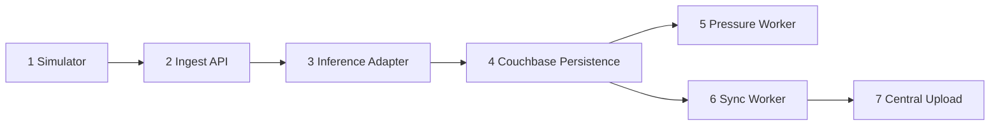

# Edge Runtime Pipeline (Single Source of Truth)

This document is the canonical design for the MVP runtime pipeline.  
Ordering is strict because data is incrementally enriched at each step.

## 0. Canonical Envelope

All steps pass a shared envelope.

```json
{
  "meta": {
    "schema_version": "1.0.0",
    "trace_id": "uuid",
    "device_id": "TURBINE_01",
    "seq": 12001,
    "ts": "2026-03-05T12:00:01Z",
    "source_type": "simulator"
  },
  "signals": {
    "temperature_c": 66.1,
    "vibration_mm_s": 2.2,
    "rpm": 1498.0,
    "power_kw": 1193.0,
    "wind_speed_m_s": 10.4
  },
  "features": {},
  "inference": {},
  "storage": {},
  "sync": {}
}
```

Mutation rule:
- A step may only add/update fields it owns.
- A step must not rewrite fields owned by earlier steps.

Raw data rule:
- `raw_payload` / raw source values are immutable after ingest.
- Pipeline stages may add metadata (`features`, `inference`, `storage`, `sync`) but must not alter raw source meaning.

Stream identity rule:
- Each stream is identified by `(device_id, source_id)`.
- Sequence is monotonic within that stream.
- Manifest checkpoints are tracked per stream, not globally.

## 1. Pipeline Order

1. Telemetry Simulator
2. Ingest API
3. Inference Adapter (black-box in MVP)
4. Persistence (Couchbase Edge)
5. Pressure Policy Worker
6. Sync Worker
7. Central Upload (mock or real)

## 2. Step-by-Step Design

### Step 1: Telemetry Simulator

Purpose:
- Produce turbine-like events continuously.

Input:
- Scenario config (`seed`, `cadence_ms`, `fault_mode`, `device_count`).

Output:
- Envelope with `meta` and `signals` populated.

Owns mutations:
- `meta.*`
- `signals.*`

Implementation notes:
- HTTP sender posts to `POST /ingest`.
- Sequence strictly increasing per device.

Done criteria:
- Stable stream with valid schema and monotonic sequence.

---

### Step 2: Ingest API

Purpose:
- Validate essential fields and ack quickly.

Input:
- HTTP payload (`{ events: [...] }` or single event).

Output:
- Valid envelopes forwarded to Step 3.
- Ack payload:

```json
{
  "accepted": 100,
  "rejected": 0,
  "last_seq": 12001
}
```

Owns mutations:
- none on envelope business fields

Validation (MVP):
- `meta.device_id`
- `meta.source_id`
- `meta.seq`
- `meta.ts`
- `signals`

Done criteria:
- Fast ack, minimal validation, no WAN dependency.

---

### Step 3: Inference Adapter (Black-Box MVP)

Purpose:
- Attach risk metadata without full ML integration yet.

Input:
- Valid envelope from Step 2.

Output:
- Same envelope with `inference` populated:

```json
{
  "inference": {
    "risk_score": 0.42,
    "risk_class": "normal",
    "model_id": "stub-v1"
  }
}
```

Owns mutations:
- `inference.*`

Implementation notes:
- Interface: `process(envelope) -> envelope`
- Swappable later with real Isolation Forest adapter.
- Model selection can use tags (for example `source_type`) to decide which stream/chunk to score.

Done criteria:
- `risk_score` and `risk_class` always present.

---

### Step 4: Persistence (Couchbase Edge)

Purpose:
- Persist event stream and per-device checkpoint state.

Input:
- Envelope from Step 3.

Output:
- `event` document write
- `manifest` upsert/update
- Envelope storage metadata

Owns mutations:
- `storage.*`

Document keys:
- `event::<device_id>::<source_id>::<seq>`
- `manifest::<device_id>::<source_id>`

Minimal document content:
- `event`: meta + signals + inference + priority
- `manifest`: `last_seen_seq`, `last_stored_seq`, `last_synced_seq`

Done criteria:
- Event retrieval works by `(device_id, seq)`.
- Manifest advances correctly.

---

### Step 5: Pressure Policy Worker

Purpose:
- Prevent storage exhaustion during offline periods.

Input:
- Storage usage metrics
- Stored events and manifest data

Output:
- Pruned event ranges
- `prune_batch` records

Owns mutations:
- Couchbase deletes on eligible events
- `prune_batch` docs

Policy:
- Start when usage `> X`
- Stop when usage `< Y`
- Never prune `inference.risk_class == "critical"`
- Prune oldest low-priority `normal` first

`prune_batch` example:

```json
{
  "type": "prune_batch",
  "device_id": "TURBINE_01",
  "from_seq": 8000,
  "to_seq": 8200,
  "dropped_count": 201,
  "reason": "pressure_XY",
  "ts": "2026-03-05T13:22:00Z"
}
```

Done criteria:
- Ingest continues under pressure.
- Critical events are preserved.

---

### Step 6: Sync Worker

Purpose:
- Send unsynced ranges to central when online.

Input:
- Manifest checkpoint (`last_synced_seq`)
- Unsynced events from Couchbase
- Network mode (online/offline)

Output:
- Upload requests to Step 7
- Manifest checkpoint updates on success

Owns mutations:
- `sync.*` (runtime status)
- `manifest.last_synced_seq`

Sync rule:
- Advance `last_synced_seq` only after central ack success.

Done criteria:
- Catch-up works after outage without duplicate side effects.

---

### Step 7: Central Upload

Purpose:
- Accept uploaded event chunks from edge.

Input:
- Batched events from Step 6.

Output:
- Ack with accepted range/count.

Owns mutations:
- Central store state only

Ack example:

```json
{
  "accepted": 200,
  "from_seq": 11801,
  "to_seq": 12000
}
```

Done criteria:
- Idempotent on `(device_id, seq)`.

## 3. Runtime Endpoints (MVP)

- `POST /ingest`
- `GET /health`
- `GET /status`
- `POST /control/network` (online/offline)
- `GET /events/recent`
- `GET /prune-batches/recent`
- `POST /central/upload`

## 4. Data Relationship Summary

- `event` documents contain raw source data plus enrichment metadata.
- `manifest` documents are compact checkpoints that point to progress in the event stream.
- Linkage is by identity tuple `(device_id, source_id, seq)`, not by pointers.
- Hash/checksum can be added for integrity but is not required for primary linkage.

## 5. Pipeline Diagram



## 6. Acceptance Checks

- Ingest rejects invalid schema and accepts valid envelopes.
- Inference adapter always adds `risk_score` and `risk_class`.
- Persistence writes `event` and updates `manifest`.
- Pressure worker never prunes critical events.
- Sync worker updates checkpoint only on successful ack.
