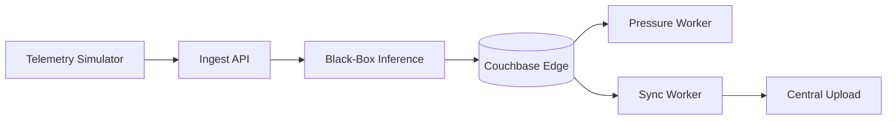

# EdgeGuard MVP Hackathon Idea

## One-Line Pitch

An offline-first edge pipeline that ingests turbine telemetry, tags each event with a simple black-box risk score, stores everything in Couchbase Edge, and applies deterministic storage pressure rules to survive outages.

## Problem

Remote turbines keep producing data during WAN outages, but edge storage is limited. Blind overwrite can remove important evidence.

## MVP Solution

Keep the system minimal and demoable:

1. Simulator sends turbine telemetry over a real API.
2. Ingest API accepts and validates essential fields only.
3. Black-box inference adds placeholder risk metadata.
4. Couchbase Edge stores events and manifest checkpoints.
5. Pressure worker prunes oldest low-priority normal data if storage is high.
6. Sync worker uploads unsynced data when network returns.

## Scope Guardrails

- One ingest endpoint only: `POST /ingest`
- No complex protocol support in MVP
- No full ML training pipeline in MVP
- No mesh offload in MVP (can be Phase 2)
- Focus on visible runtime behavior in demo

## End-to-End MVP Flow

## Core Data Contracts

`event`

- `device_id`, `seq`, `ts`
- `signals`
- `risk_score`, `risk_class` (from black-box inference)
- `priority`

`manifest`

- `device_id`
- `last_seen_seq`
- `last_stored_seq`
- `last_synced_seq`

`prune_batch`

- `device_id`
- `from_seq`, `to_seq`
- `dropped_count`
- `reason`
- `ts`

## Pressure Policy (Simple)

- Trigger pruning at storage `> X`
- Stop pruning at storage `< Y`
- Never prune `critical`
- Prune oldest low-priority `normal` first
- Record one `prune_batch` per prune action

## Demo Plan (5 min)

1. Start simulator and show ingest rate.
2. Show events being stored in Couchbase.
3. Toggle offline mode and let backlog/storage grow.
4. Cross threshold `X` and show pressure pruning.
5. Show critical events preserved.
6. Toggle online and show sync catching up.

## Why This Can Win

- Clear real-world outage problem
- Simple architecture judges can follow quickly
- Deterministic and auditable pressure behavior
- Practical offline-first design on CPU-only edge runtime
